# Simple Docker

## Part 1. Готовый докер.
* 1.1 Использование команды docker pull для выкачки докера nginx
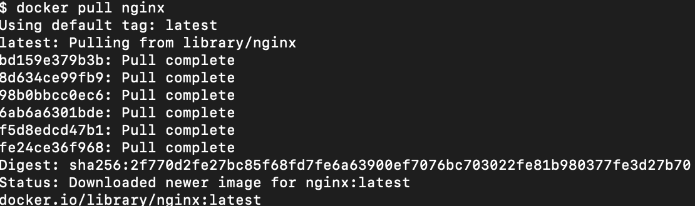
* 1.2 Проверка наличия докер образа при помощи команды docker images

* 1.3 Запуск докер образа при помощи команды docker run -d image_id
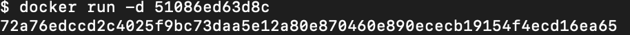
* 1.4 Проверка запуска докера при помощи команды docker ps
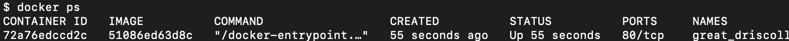
* 1.5 Просмотр информации о контейнере при помощи команды docker inspect container_id
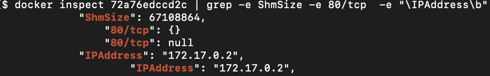
* 1.6 Остановка докер образа и проверка, что он остановился
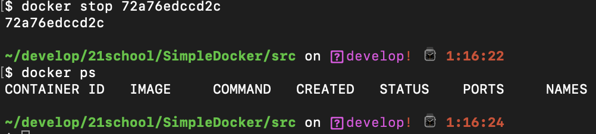
* 1.7 Запуск докера с замапленными портами 80 и 443 через run

* 1.8 Проверка на доступность стартовой страницы nginx по адресу localhost:80 в браузере
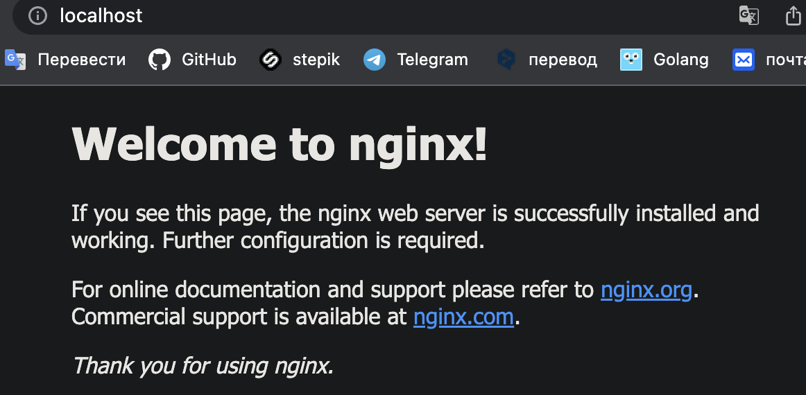
* 1.9 Перезапуск докера и проверка, что он запустился
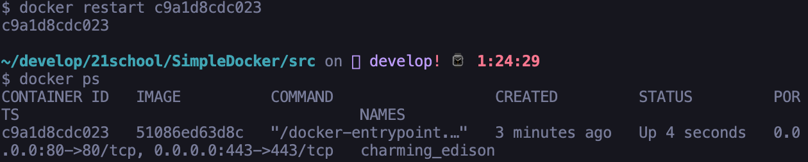

## Part 2. Операции с контейнером

* 2.1 Вывод содрежимого файла nginx.conf через exec
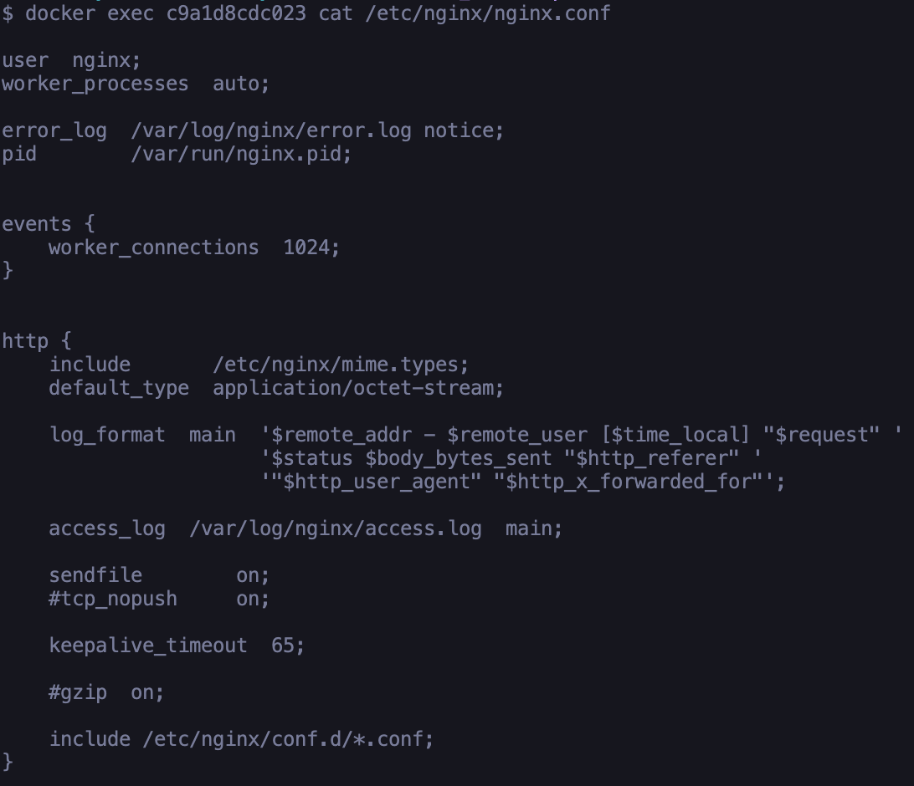
* 2.2 Создание на локальной машине файла nginx.conf. Настройка в нем по пути /status отдачу страницы статуса сервера
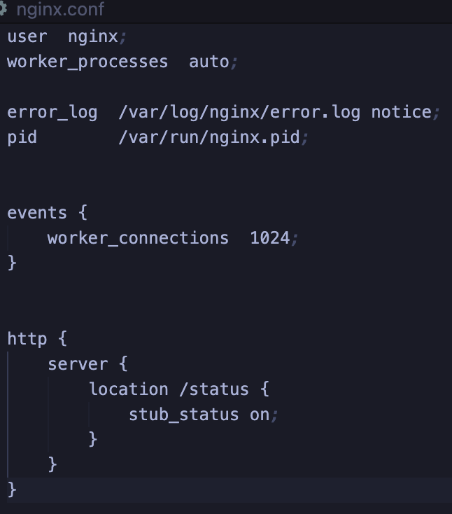
* 2.3 Копирование файла nginx.conf внутрь докер образа.
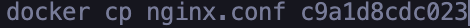
* Перезапуск nginx внутри докер образа.
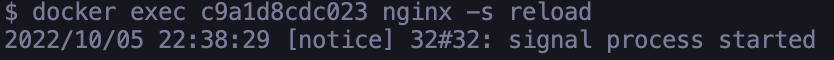
* Проверка статуса сервера.
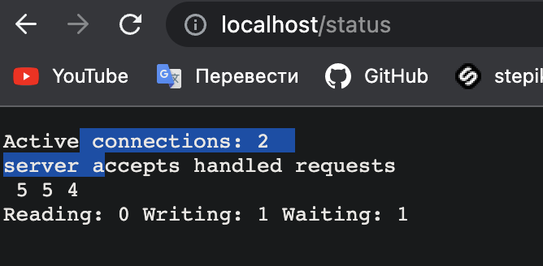
*2.4 Экспорт контейнера в файл. Остановка контейнера
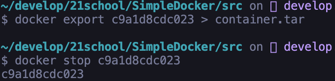
* 2.5 Удаление образа
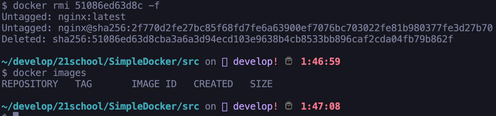
* 2.6 Удаление остановленного контейнера

* 2.7 Импорт контейнера обратно. Запуск импортированного контейнера. Проверка работоспособности контейнера
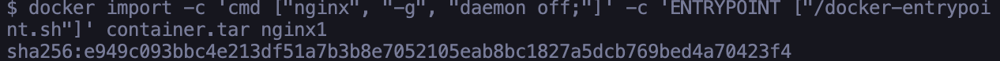
* Запуск импортированного контейнера. 
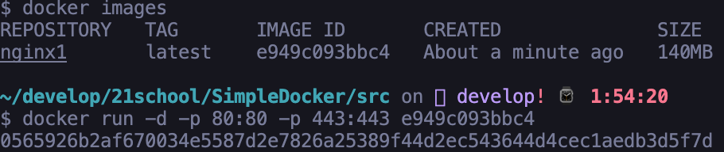
* Проверка работоспособности контейнера
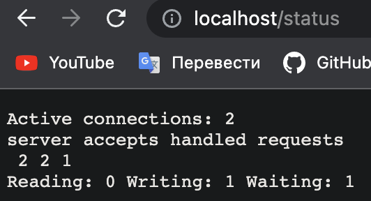

## Part 3. Мини веб-сервер

* 3.1 Создание образа и запуск контейнера на порту 81
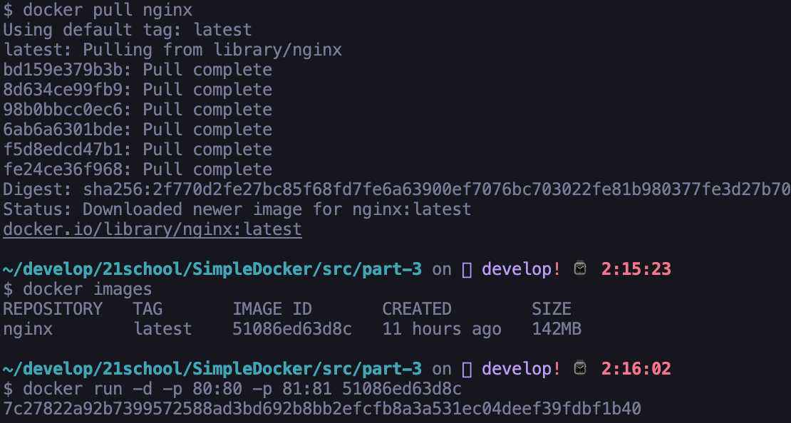
* 3.2 файл мини-сервера и nginx.conf
* [Server file](server/main.c)
* [Nginx conf](server/nginx/nginx.conf)
* 3.3 Проверка nginx.conf и main.c в контейнере
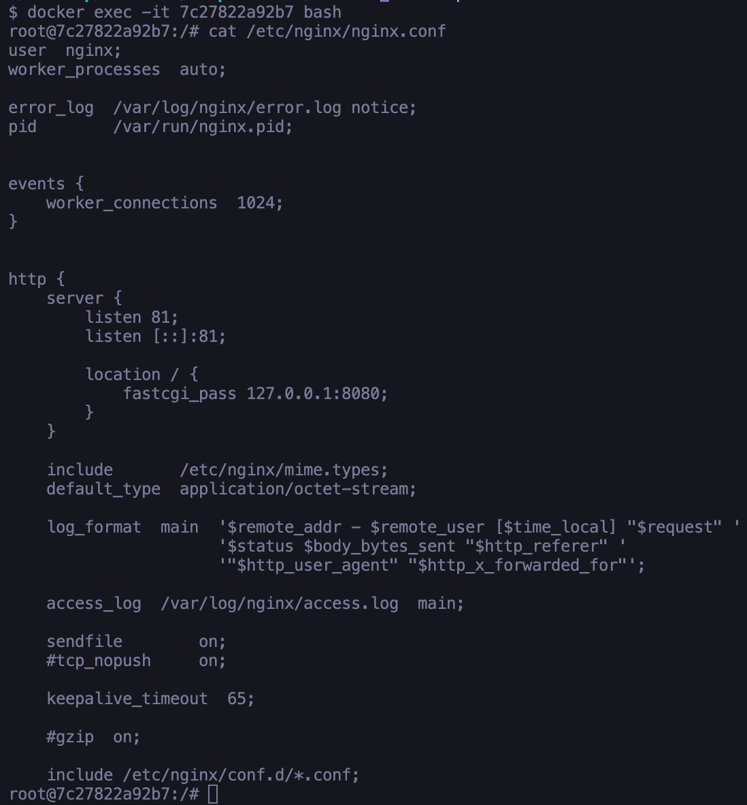
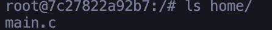
* 3.4 Установка gcc, spawn-dcgi, libfcgi-dev
* Перед этим нужно обновить систему `apt-get update`
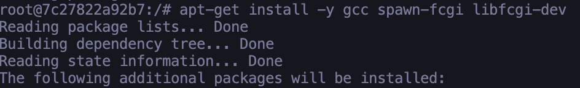
* 3.5 Запуск сервера
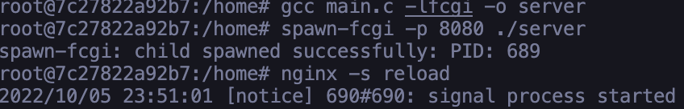
* Проверка
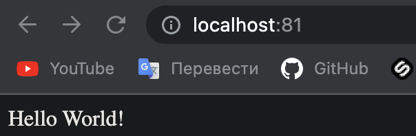

## Part 4. Свой докер

* 4.1 Создание докер образа. Запуск контейнера и проверка страницы localhost:80
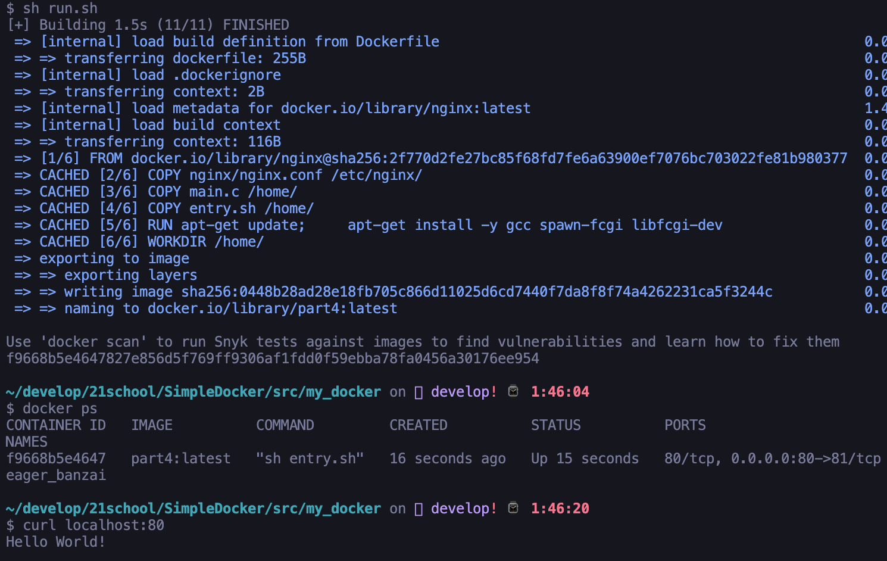
* 4.5 Добавление в файл nginx.conf проксирование странички /status
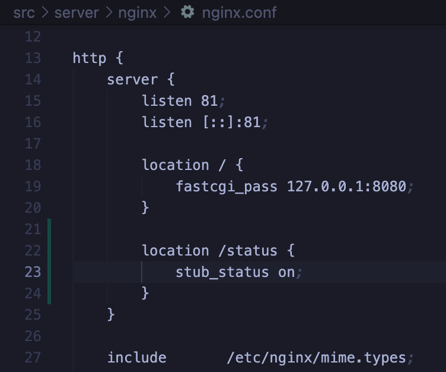
* 4.6 Проверка страницы /status   
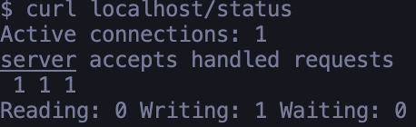
* [Source files](my_docker/)

## Part 5. **Dockle**

* 5.1 Сканирование образа                                  

* 5.2 Проверка на отсутствие ошибок и предупреждений после исправления образа
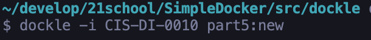
* [Source files](dockle/)

## Part 6. Базовый **Docker Compose**
* Проверка на работоспособность после сборки и запуска                
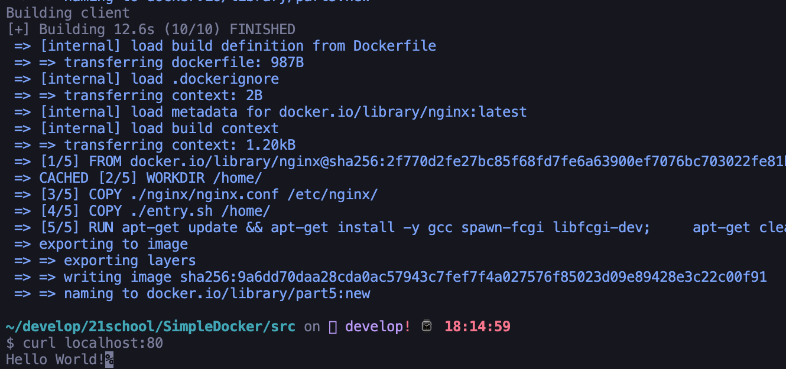
